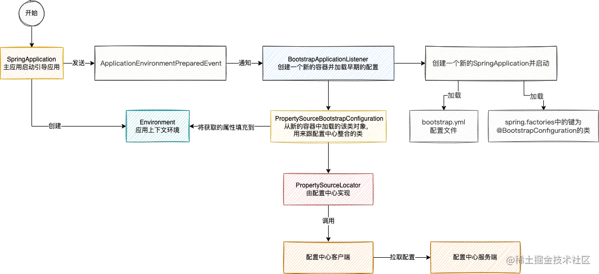
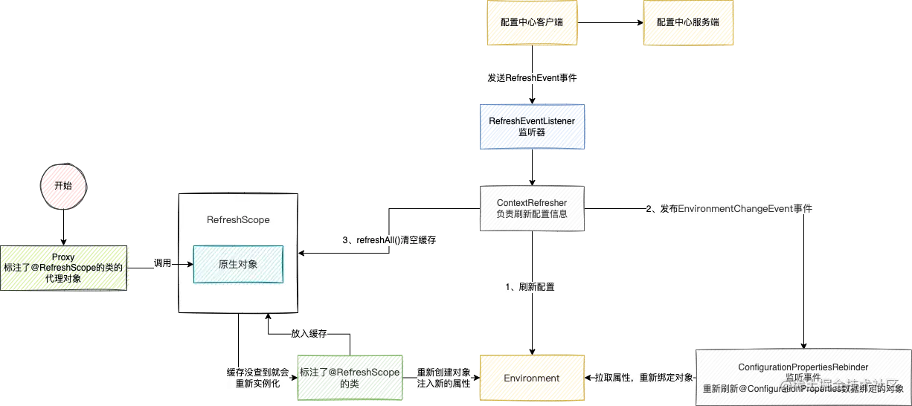

### SpringCloud配置中心的原理
#### 1.项目启动是如何从配置中心加载数据的？
在SpringCloud环境下，当项目启动的时候，在SpringBoot应用容器创建之前，会先创建一个容器，这个容器非常重要，这个容器是用来跟配置中心交互，拉取配置的。
这个容器在启动的时候会干两件事：

- 加载bootstrap配置文件，这就是为什么配置中心的配置信息需要写在bootstrap配置文件的重要原因
- 加载所有spring.factories文件中的键为org.springframework.cloud.bootstrap.BootstrapConfiguration对应的配置类，将这些配置类注入到这个容器中，注意这里是不会加载@EnbaleAutoConfiguration自动装配的类

当这两件事都做好之后，会从这个容器中获取到所有的PropertySourceLocator这个接口的实现类对象，依次调用locate方法。

### 如何实现注入到Bean中的属性动态刷新
SpringCloud中规定，当配置中心客户端一旦感知到服务端的某个配置有变化的时候，需要发布一个RefreshEvent事件来告诉SpringCloud配置有变动。

在SpringCloud中RefreshEventListener类会去监听这个事件，一旦监听到这个事件，就会进行两步操作来刷新注入到对象的属性。

RefreshEventListener

- 从配置中心再次拉取属性值，而这个拉取的代码逻辑跟项目启动时拉取的属性值核心逻辑几乎是一样的，也是创建一个新的spring容器，加载配置文件和配置类，最后通过PropertySourceLocator获取属性，这一部分核心的代码逻辑是复用的。
- 有了最新的属性之后，就开始刷新对象的属性。

刷新的逻辑实现的非常的巧妙，可不是你以为的简单地将新的属性重新注入对象中，而是通过动态代理的方式来实现的。

